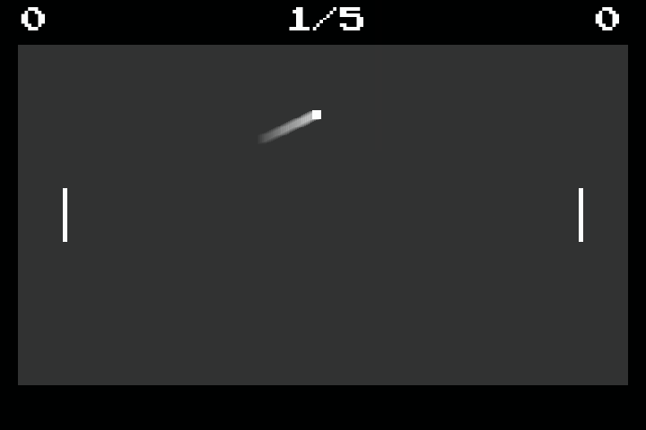

# Pong

A Pong game in C using SDL2.



## Requirements

Arch Linux:
- gcc
- cmake
- make
- sdl2
- sdl2_ttf

## Compiling and Running
```console
$ echo Release > config.txt
$ ./build.sh
$ ./run.sh
```

## Controls

- **ESC**: quit
- **Up**/**Down**: right pallet movement
- **a**/**z**: left pallet movement
